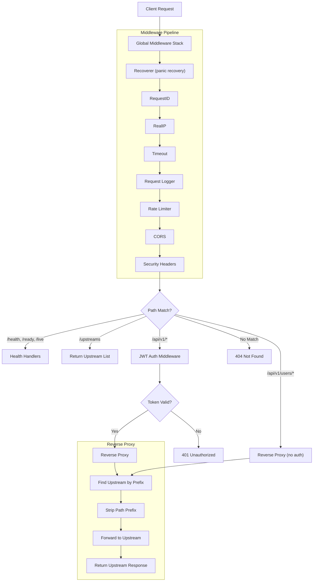
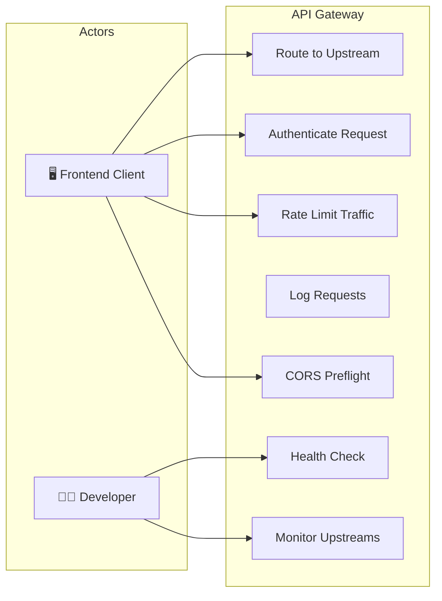
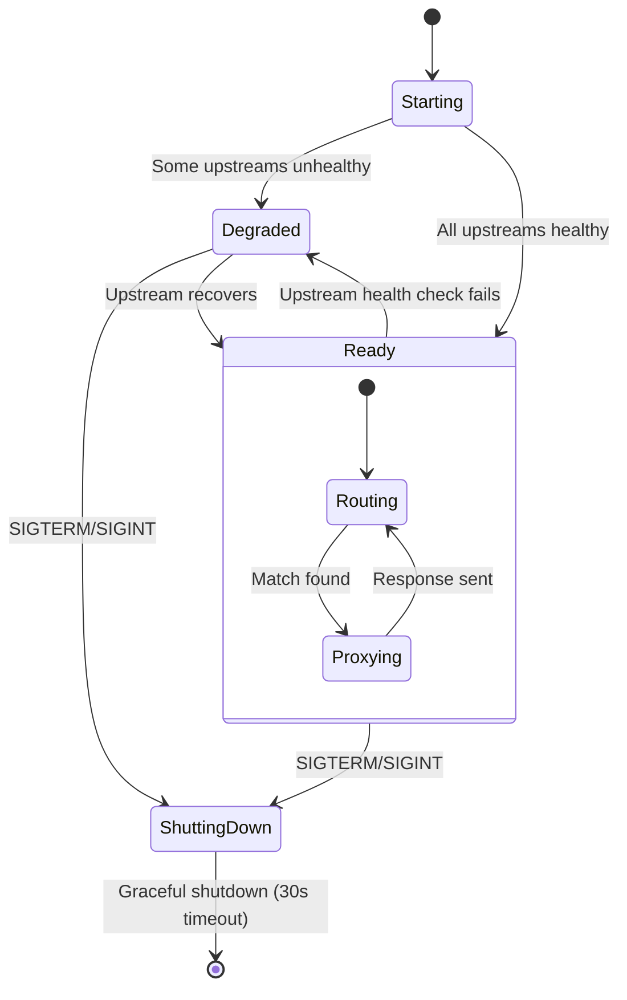
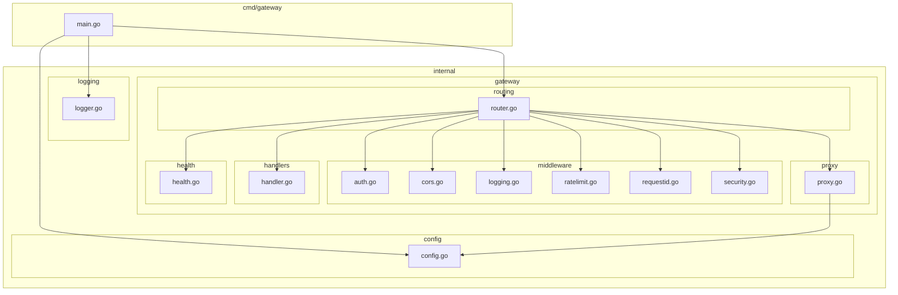

# 🌐 API Gateway (BookingAPI)

> Reverse-proxy API gateway that routes, authenticates, and rate-limits all incoming traffic for the Hotel Reservation Platform.

## Overview

The API Gateway (BookingAPI) is the **single entry point** for all client traffic. It acts as a reverse proxy, routing requests to the appropriate upstream microservice based on URL path prefixes. It provides centralized cross-cutting concerns: JWT authentication, rate limiting, CORS, security headers, request logging, and upstream health monitoring.

## Tech Stack

| Layer | Technology |
|---|---|
| Language | Go 1.25 |
| Router | [go-chi/chi](https://github.com/go-chi/chi) v5 |
| Proxy | `net/http/httputil` (stdlib reverse proxy) |
| Auth | JWT verification (RSA-256 public key) |
| Container | Docker (multi-stage Alpine build) |

## Architecture

```
cmd/
└── gateway/
    └── main.go           # Application entrypoint
internal/
├── config/               # YAML config loader
├── logging/              # Structured slog logger
└── gateway/
    ├── handlers/         # Health check handlers
    │   └── handler.go
    ├── health/           # Periodic upstream health checker
    │   └── health.go
    ├── middleware/        # Middleware stack
    │   ├── auth.go       # JWT authentication
    │   ├── cors.go       # CORS headers
    │   ├── logging.go    # Request logging
    │   ├── ratelimit.go  # Token bucket rate limiter
    │   ├── requestid.go  # X-Request-ID injection
    │   └── security.go   # Security headers (CSP, HSTS, etc.)
    ├── proxy/            # Reverse proxy engine
    │   └── proxy.go
    └── routing/          # Route configuration
        └── router.go
config.yaml               # Gateway configuration
Dockerfile
go.mod
```

## Routing Table

The gateway routes requests based on **longest path prefix match**:

| Path Prefix | Upstream Service | Auth Required |
|---|---|---|
| `/api/v1/users/*` | `http://user-service:8080` | ❌ (public registration/login) |
| `/api/v1/hotels/*` | `http://hotel-service:8080` | ✅ |
| `/api/v1/rooms/*` | `http://rooms-service:8080` | ✅ |
| `/api/v1/bookings/*` | `http://booking-service:8080` | ✅ |
| `/api/v1/*` (catch-all) | `http://bff-service:8080` | ✅ |
| `/health` | Self (gateway) | ❌ |
| `/ready` | Self (gateway) | ❌ |
| `/live` | Self (gateway) | ❌ |
| `/upstreams` | Self (returns upstream list) | ❌ |

> **Note**: The `/api/v1/users/*` route is **unprotected** to allow registration and login without a JWT.

## Flow Diagram



## Use Case Diagram



## State Diagram



## Package Diagram



## Middleware Stack (Order)

1. **Recoverer** — Catches panics, returns 500
2. **RequestID** — Injects `X-Request-ID` header
3. **RealIP** — Extracts real client IP from proxy headers
4. **Timeout** — Enforces `read_timeout` from config
5. **Request Logger** — Logs method, path, remote_addr
6. **Rate Limiter** — Token bucket (100 req/s, burst 200)
7. **CORS** — Permissive cross-origin policy
8. **Security Headers** — CSP, HSTS, X-Frame-Options, etc.
9. **JWT Auth** — (only on `/api/v1/*` routes, except users)

## Configuration

```yaml
server:
  host: "0.0.0.0"
  port: 8080
  read_timeout: 15s
  write_timeout: 15s
  idle_timeout: 60s

rate_limit:
  enabled: true
  requests_per_second: 100
  burst: 200

upstreams:
  - name: "users-service"
    url: "http://user-service:8080"
    path_prefix: "/api/v1/users"
    timeout: 10s
    health_path: "/health"
  # ... more upstreams
```

## Port Mapping

| Context | Port |
|---|---|
| Internal (container) | `8080` |
| External (host) | `8080` |
